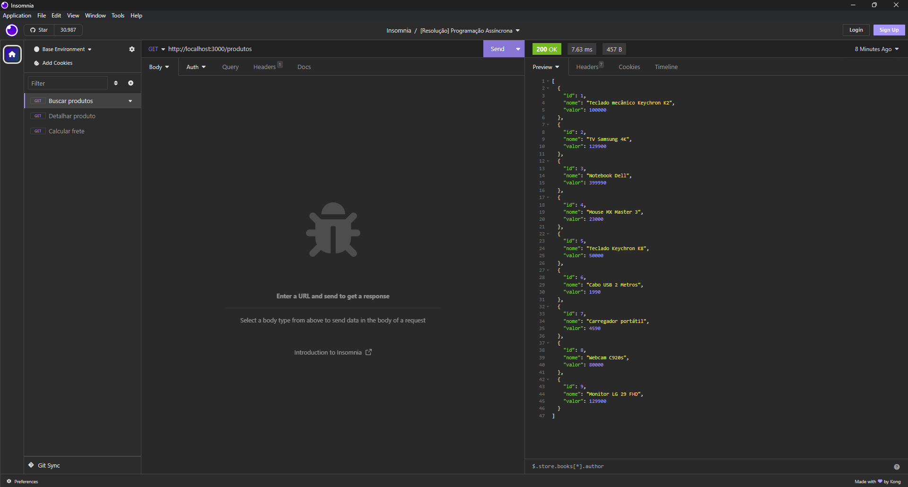
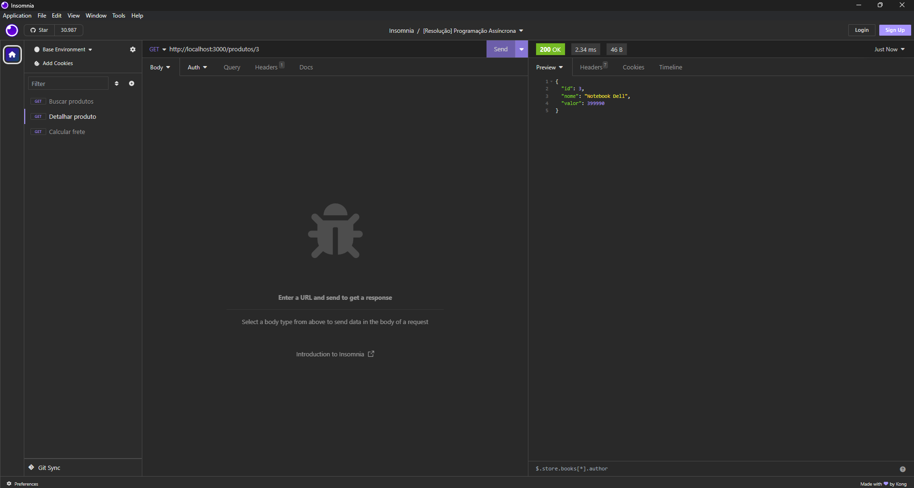
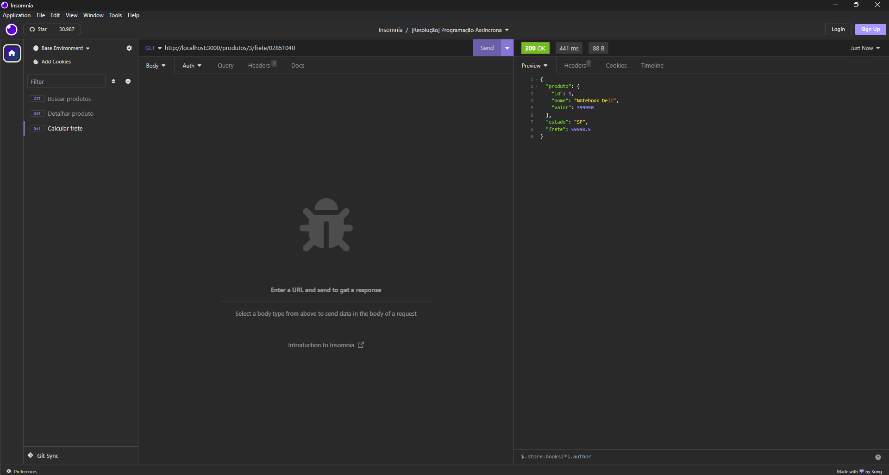

# exercicio-modulo2-frete-api 

Este repositório contém um exercício prático realizado durante o módulo 02 do curso da Cubos Academy, que abordou o desenvolvimento de APIs REST. O exercício se concentrou na criação de uma API para calcular o frete de produtos com base em regras específicas.

## Descrição do Exercício

Neste exercício, criamos uma API REST com três rotas, todas usando o método GET:

1. **Rota `/produtos`**: Esta rota lista os produtos disponíveis a partir de um arquivo `produtos.js` localizado na pasta `bancodedados`.

2. **Rota `/produtos/:idProduto`**: Permite o detalhamento de um produto com base em seu ID, passado como parâmetro na rota.

3. **Rota `/produtos/:idProduto/frete/:cep`**: Recebe dois parâmetros de rota, `idProduto` e `cep`, para calcular o frete do produto com base nas regras fornecidas. O estado correspondente ao CEP é obtido usando a função `getStateFromZipcode` da biblioteca `utils-playground`.

## Regras para Cálculo de Frete

- O valor padrão do frete é de `12%` do valor do produto.
- Para os estados `BA, SE, AL, PE e PB`, o valor do frete é de `10%`.
- Para os estados `SP e RJ`, o valor do frete é de `15%`.

## Uso do Repositório

Este repositório contém o código fonte da API, incluindo os arquivos necessários para o cálculo de frete. Você pode clonar este repositório e executar a API localmente para entender como ela funciona ou continuar o desenvolvimento.

## Instalação e Execução

1. Clone o repositório para o seu computador:

   ```
   git clone <URL_do_repositorio_no_GitHub>

2. Instale as dependências usando npm:

    ```
    npm install

3. Inicie o servidor:

    ```
    npm run dev

A API estará disponível em http://localhost:3000.

## Sobre este Repositório

Este aqui é um repositório dedicado principalmente aos meus estudos no curso da Cubos Academy. Ele foi criado como parte do exercício do Módulo 2, onde aprendemos sobre o desenvolvimento de APIs REST.

## Contribuições e Discussões

Este é um espaço destinado principalmente aos meus próprios aprendizados e experimentos, então não estou buscando contribuições externas aqui. No entanto, se você também é um estudante da Cubos Academy e deseja discutir ou compartilhar ideias sobre o exercício, fique à vontade para fazê-lo no ambiente do curso. Adoro trocar ideias com colegas e instrutores!

Vamos continuar aprendendo juntos!

## Uso da API

A API de cálculo de frete pode ser acessada através de diversas rotas. Abaixo estão exemplos de como usar cada uma delas com o Insomnia ou outro cliente HTTP.

### Listagem de Produtos

- **Rota**: `/produtos`
- **Método**: GET



Para listar todos os produtos disponíveis:

1. Abra o Insomnia ou seu cliente HTTP de escolha.

2. Crie uma solicitação GET para `http://localhost:3000/produtos`.

3. Envie a solicitação e você receberá a lista de produtos disponíveis.

### Detalhamento de Produto

- **Rota**: `/produtos/:idProduto`
- **Método**: GET



Para detalhar um produto específico, substitua `:idProduto` pelo ID do produto desejado:

1. Abra o Insomnia ou seu cliente HTTP de escolha.

2. Crie uma solicitação GET para `http://localhost:3000/produtos/1` (substitua `1` pelo ID do produto desejado).

3. Envie a solicitação e você receberá os detalhes do produto.

### Cálculo de Frete

- **Rota**: `/produtos/:idProduto/frete/:cep`
- **Método**: GET



Para calcular o frete de um produto, substitua `:idProduto` pelo ID do produto desejado e `:cep` pelo CEP desejado:

1. Abra o Insomnia ou seu cliente HTTP de escolha.

2. Crie uma solicitação GET para `http://localhost:3000/produtos/1/frete/12345678` (substitua `1` pelo ID do produto e `12345678` pelo CEP desejado).

3. Envie a solicitação e você receberá o cálculo do frete com base nas regras específicas.

Obrigada por verificar este projeto! Espero que seja útil para você.
